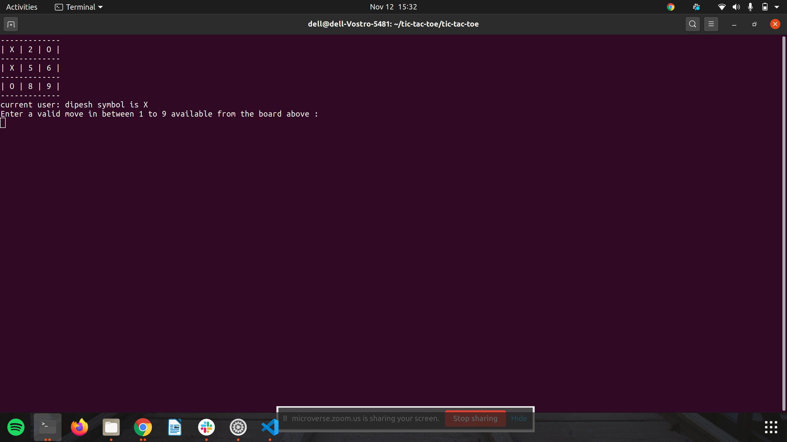

# TIC-TAC-TOE 

> This project is about building tic-toe-game



### Rules of the tic-tac-toe game 

- The game is played on a grid that's 3 squares by 3 squares.

- The first player is player1, and the second player is player2. Players take turns putting their marks either X or O.

- The first player to get 3 of their marks in a row (up, down, across, or diagonally) is the winner.

- When all 9 squares are full, the game is over. If no player has 3 marks in a row, the game ends in a draw.


## How to use this repo?

```
* Clone the repo
# Clone this repository
$ git clone https://github.com/dibdas/tic-tac-toe.git

# Go into the folder tic-tac-toe where the game is present
$ cd tic-tac-toe

# Navigate to bin folder
$ cd bin

# In command prompt, run the following command
$ ./main.rb

```

Follow the prompts and enjoy the game!

## About the project.

The project contains **lib** directory with `board.rb`, `player.rb`, and `game_logic.rb` files. And these files contain the flow of the game as:
1. `player.rb` file has a `Player` class which is responsible for the player instance in the game.
    - `Player` class is initialized with `name` and `symbol` for the player.
    - player `moves` is stored in the instance variable.

2. `board.rb` file is responsible for drawing the board as an interface for the user. It has a `Board` class with functionality:
    -  has an instance variable `@cells` which stores hash value for the board from 1 - 9 with respective output value to output in the board.
    - has a method `#draw` which draws the board in the console as:
    ```
    -------------
    | 1 | 2 | 3 |
    -------------
    | 4 | 5 | 6 |
    -------------
    | 7 | 8 | 9 |
    -------------
    ```
    - has a method `#update` which updates the board value.

3. `game_logic.rb` file is responsible for all other game logic implemented in the game. The functionality are:

    **Initialization**
    - It is initialized with two-player who are playing the game.
    - initialized with an `@array` for a board value.
    - initialized with a `@turn` instance variable to `true` to manipulate the user's turn.
    - initialized with all possible winning moves in instance variable `@winning_move`.

    **Methods**
    - `#start` method is responsible to start the game between two users.
    - `#choice` method ask for the user's choice for the value to update their move on the board.
    - `#updating_move` is responsible to update the user move in `Player.moves`.
    - `#valid_move?` method validate the move chosen by the user.
    - `#update_board` method updates the valid move chosen by the user.
    - `#current_user` method returns the current player who is playing the game based on `@turn`
    - `#change_turn` method changes the turn to `true` or `false`.
    - `#winning_move` method is responsible for checking if the user's current move is winning or not.
    - `#draw_move` method returns the message as a draw if the game was drawn.

The project also contains **bin** folder where there is **executable file** `main.rb` which is responsible for users' inputs and outputs to the game.

## Built With

- Ruby

## Authors

👤 **Dipesh Bajgain**

- GitHub: [@dipbazz](https://github.com/dipbazz)
- Twitter: [@dipbazz](https://twitter.com/dipbazz)
- LinkedIn: [Dipesh Bajgain](https://www.linkedin.com/in/dipbazz/)

👤 **Dibyendu Das**

- GitHub: [@DibDas](https://github.com/dibdas)
- Twitter: [@DIBYEND78120480](https://twitter.com/DIBYEND78120480)
- LinkedIn: [Dibyendu Das](https://www.linkedin.com/in/dibyendu-das-b5967a1b1/)

## 🤝 Contributing

Contributions, issues, and feature requests are welcome!

## Show your support

Give a ⭐️ if you like this project!

## Acknowledgments

- Ruby docmentation
- [Ruby Guides](https://www.rubyguides.com/)


